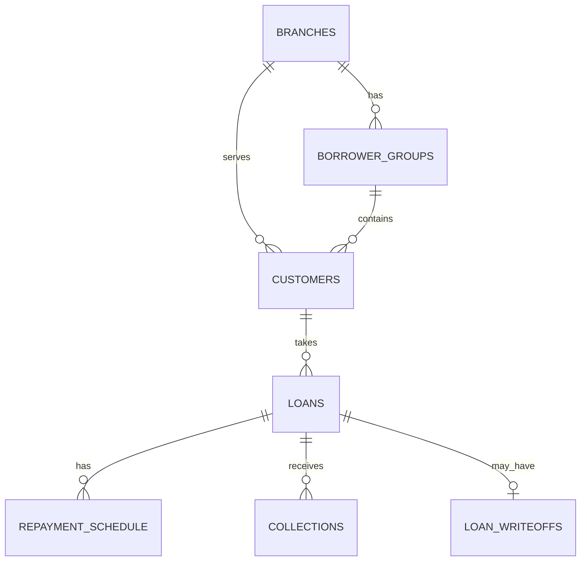

# LoanPulse: Data Model

## Overview
Source data comes from 7 tables that represent the bank's operational systems.
LoanPulse transforms them into 3 output tables used for reporting.

## Relationships

- One branch has many groups and many customers
- One group has 5 to 10 customers
- One customer can take more than one loan over time
- One loan has many scheduled installments
- One loan can receive many payments
- One loan can have at most one write-off

## Table categories

| Category | Tables | Behaviour |
|---|---|---|
| Master data | branches, borrower_groups, customers | Changes rarely |
| Contract data | loans, repayment_schedule | Created once at disbursement |
| Transaction data | collections, loan_writeoffs | New records arrive daily |

## Source tables

### branches
| Column | Type | Description |
|---|---|---|
| branch_id | VARCHAR | Primary key, example BR001 |
| branch_name | VARCHAR | Branch name |
| district | VARCHAR | District |
| state | VARCHAR | State |
| opened_date | DATE | Date branch opened |

### borrower_groups
| Column | Type | Description |
|---|---|---|
| group_id | VARCHAR | Primary key, example GRP0001 |
| branch_id | VARCHAR | Foreign key to branches |
| formed_date | DATE | Date group was formed |

### customers
| Column | Type | Description |
|---|---|---|
| customer_id | VARCHAR | Primary key, example CUST00001 |
| full_name | VARCHAR | Name (PII) |
| phone | VARCHAR | Phone number (PII) |
| aadhaar_number | VARCHAR | Fake Aadhaar number (PII) |
| group_id | VARCHAR | Foreign key to borrower_groups |
| branch_id | VARCHAR | Foreign key to branches |
| occupation | VARCHAR | Example: kirana shop, tailoring, dairy |
| onboarded_date | DATE | Date customer joined |

### loans
| Column | Type | Description |
|---|---|---|
| loan_id | VARCHAR | Primary key, example LN000001 |
| customer_id | VARCHAR | Foreign key to customers |
| product_type | VARCHAR | MICROFINANCE_JLG |
| principal_amount | NUMBER(12,2) | Amount lent |
| interest_rate | NUMBER(5,2) | Annual interest rate in percent |
| tenure_months | NUMBER | Number of monthly installments |
| disbursement_date | DATE | Date money was given |

### repayment_schedule
| Column | Type | Description |
|---|---|---|
| loan_id | VARCHAR | Foreign key to loans |
| installment_number | NUMBER | 1, 2, 3 and so on |
| due_date | DATE | Date installment is due |
| principal_due | NUMBER(12,2) | Principal part |
| interest_due | NUMBER(12,2) | Interest part |
| total_due | NUMBER(12,2) | principal_due plus interest_due |

Primary key: loan_id plus installment_number

### collections
| Column | Type | Description |
|---|---|---|
| collection_id | VARCHAR | Primary key, example COL0000001 |
| loan_id | VARCHAR | Foreign key to loans |
| payment_date | DATE | Date borrower paid |
| posted_date | DATE | Date payment was recorded, can be later |
| amount | NUMBER(12,2) | Amount paid |
| payment_mode | VARCHAR | CASH or UPI |
| field_officer_id | VARCHAR | Officer who collected |

### loan_writeoffs
| Column | Type | Description |
|---|---|---|
| loan_id | VARCHAR | Primary key and foreign key to loans |
| writeoff_date | DATE | Date loan was written off |
| writeoff_amount | NUMBER(12,2) | Outstanding amount written off |

## Output tables

### loan_daily_status
**Grain:** one row per loan per day, from disbursement until closure or write-off.

| Column | Description |
|---|---|
| status_date | The day this row describes |
| loan_id | Loan |
| branch_id | Branch |
| outstanding_principal | Principal unpaid on this day |
| overdue_amount | Total of unpaid installments past due date |
| dpd | Days past due |
| asset_class | STANDARD, SMA_0, SMA_1, SMA_2, NPA |
| is_written_off | True if written off on or before this day |

### portfolio_month_end_snapshot
**Grain:** one row per loan per month-end. Frozen once created.

Same columns as loan_daily_status, plus:

| Column | Description |
|---|---|
| snapshot_month | Month the snapshot belongs to |
| snapshot_created_at | When the snapshot was frozen |

### branch_monthly_metrics
**Grain:** one row per branch per month.

| Column | Description |
|---|---|
| snapshot_month | Month |
| branch_id | Branch |
| total_outstanding | Total principal outstanding |
| npa_outstanding | Outstanding of NPA loans |
| gnpa_ratio | npa_outstanding divided by total_outstanding |
| par_30 | Outstanding with DPD more than 30, divided by total |
| amount_due | Installments due in the month |
| amount_collected | Payments received for the month |
| collection_efficiency | amount_collected divided by amount_due |

## Key design decisions

1. **Two dates on every payment.** payment_date drives DPD calculation.
   posted_date shows when data arrived. This allows correct DPD even
   when payments are recorded late.

2. **DPD is recalculated from full payment history.** Each day, DPD is
   rebuilt from the schedule and all payments posted so far. This is
   simpler than updating old rows and always gives the correct answer.

3. **Oldest installment first.** Every payment clears the oldest unpaid
   installment before newer ones.

4. **NPA upgrade only after full arrears are cleared**, following the
   RBI rule.

5. **Month-end snapshots are frozen.** They are written once and never
   updated, so past reports can always be reproduced.

6. **Table named borrower_groups, not groups.** GROUP and GROUPS are
   SQL keywords. Avoiding them prevents confusing errors.

7. **Small data volume by choice.** The design works at any scale.
   Volume is kept small to stay within free cloud credits.